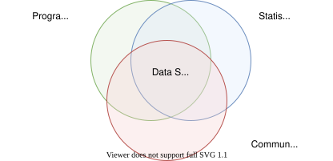
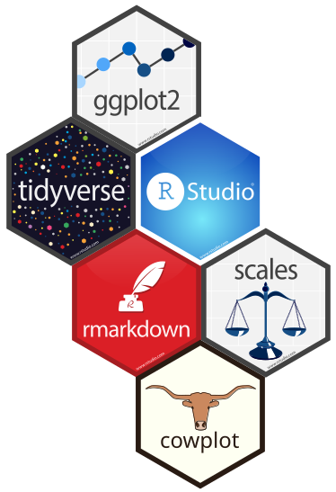
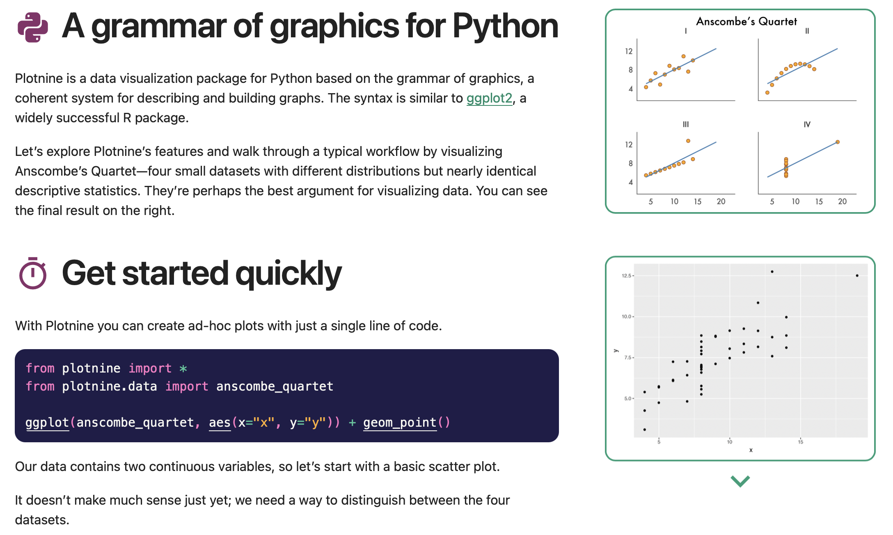
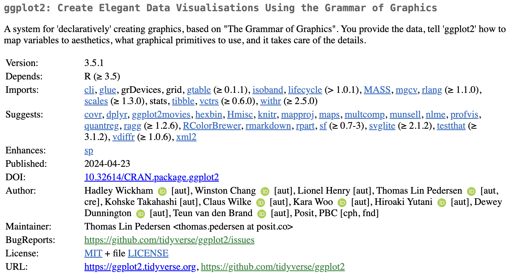
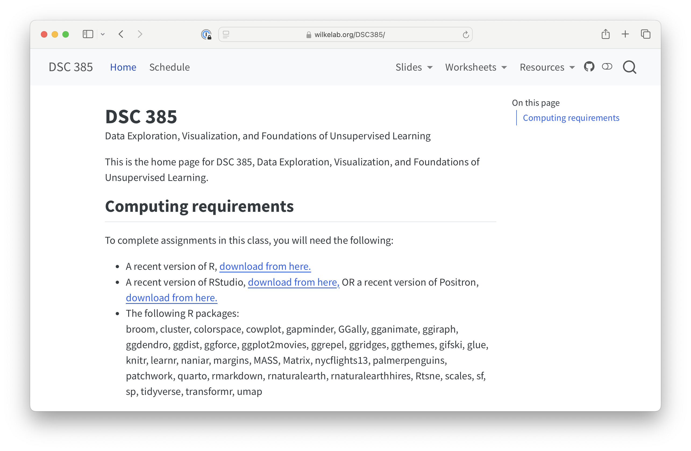
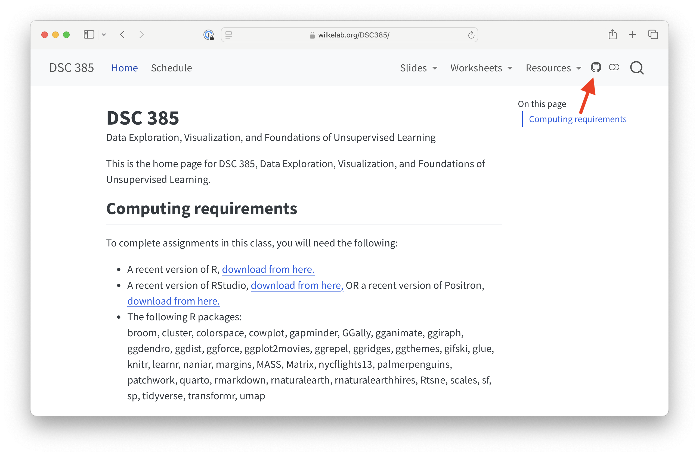
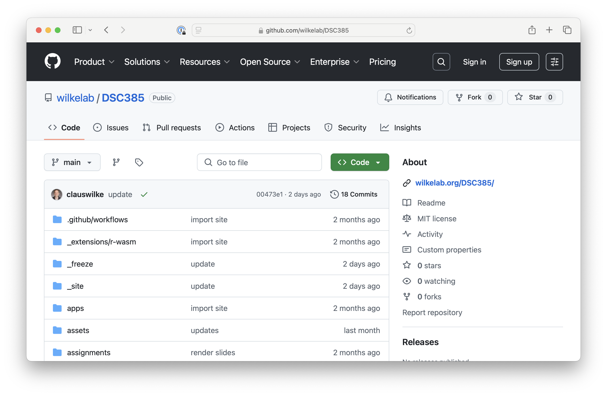
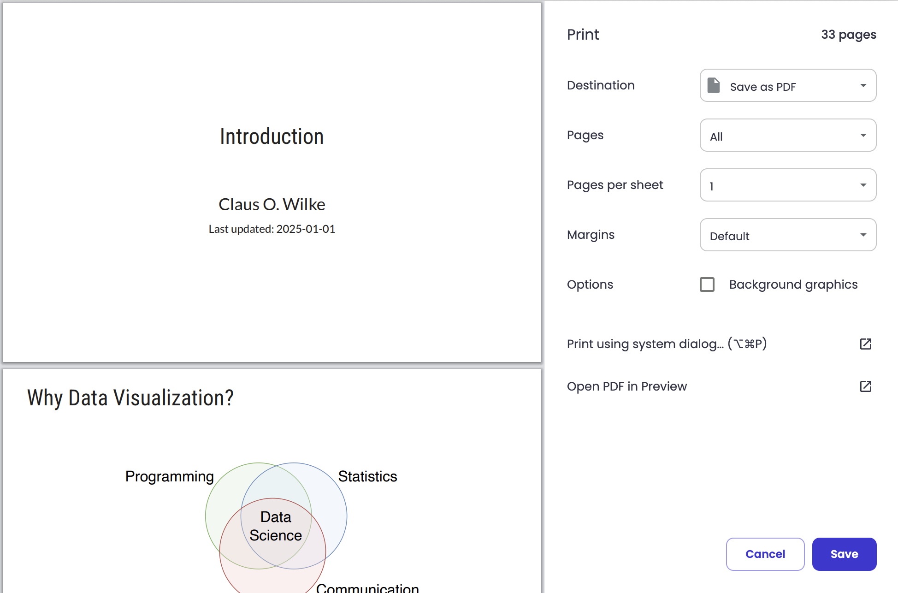
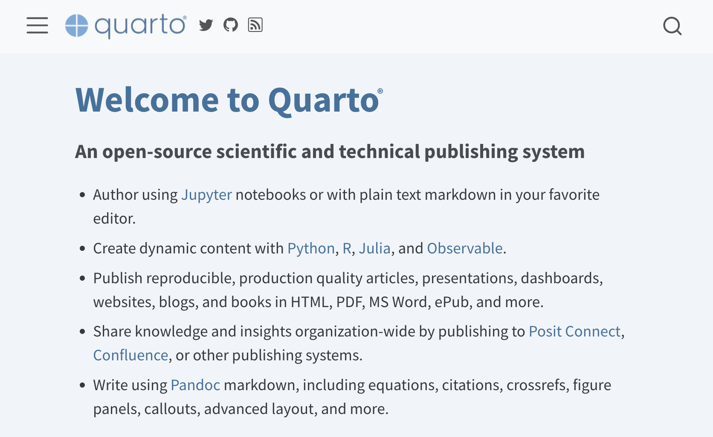

## Data visualization is integral to data science

{.fragment .absolute  top="20%" left="20%" width="60%" }

## Data visualization is integral to data science

{.absolute  top="20%" left="20%" width="60%" }

## We will use R throughout this class

::: {.fragment}

{.absolute  top="10%" left="15%" width="25%" }

{.absolute  top="49%" left="8%" width="40%" }
:::

{.fragment .absolute  top="5%" left="55%" width="35%" }

## What about Python?

::: {.incremental}
- Can we use Python for assignments in this class?  
  [No, all assignments require R]{.fragment .highlight}
- Will what we learn here apply to Python?  
  [Yes, all concepts carry over; also, look into plotnine]{.fragment .highlight}
:::

::: {.fragment}
{.absolute  top="40%" left="25%" width="50%" style="box-shadow: 3px 5px 3px 1px #00000080;"}

::: {.absolute-bottom-right .tiny-font}
<https://plotnine.org/>
:::

:::

## Who am I?

## Who am I?

{.absolute  top="7%" left="0%" width="42%" style="box-shadow: 3px 5px 3px 1px #00000080;"}

::: {.absolute-bottom-left .small-font}
[https://clauswilke.com/dataviz](https://clauswilke.com/dataviz)
:::

{.fragment .absolute  top="5%" left="45%" width="35%" style="box-shadow: 3px 5px 3px 1px #00000080;"}

{.fragment .absolute  top="15%" left="55%" width="35%" style="box-shadow: 3px 5px 3px 1px #00000080;"}

{.fragment .absolute  top="25%" left="65%" width="35%" style="box-shadow: 3px 5px 3px 1px #00000080;"}

{.fragment .absolute  top="35%" left="50%" width="35%" style="box-shadow: 3px 5px 3px 1px #00000080;"}

{.fragment .absolute  top="45%" left="60%" width="35%" style="box-shadow: 3px 5px 3px 1px #00000080;"}

## Who am I?

::: {.center-text}
{width="100%" style="box-shadow: 3px 5px 3px 1px #00000080;"}
:::

<!-- Segment ends here -->

# Class materials and computing environment

## Slides and worksheets are posted on the class website

::: {.move-up-1em .center-text}
{width="90%"}
:::

::: {.absolute-bottom-right .tiny-font}
<https://wilkelab.org/DSC385>
:::

## The source for the class website is on GitHub

::: {.move-up-1em .center-text}
{width="90%"}
:::

::: {.absolute-bottom-right .tiny-font}
<https://github.com/wilkelab/DSC385>
:::

## The source for the class website is on GitHub

::: {.move-up-1em .center-text}
{width="85%"}
:::

::: {.absolute-bottom-right .tiny-font}
<https://github.com/wilkelab/DSC385>
:::

## Press 'e' to save slides as PDF

::: {.center-text}
{width="70%" style="box-shadow: 3px 5px 3px 1px #00000080;"}
:::

(Works best on Chrome)

## Setting up a working R environment

::: {.fragment}
To run R on your own computer:
:::

## Setting up a working R environment

To run R on your own computer:

1. Download R from here: <https://cloud.r-project.org/>

## Setting up a working R environment

To run R on your own computer:

1. Download R from here: <https://cloud.r-project.org/>

2. Download either RStudio or Positron  
  RStudio: <https://posit.co/download/rstudio-desktop/>  
  Positron: <https://positron.posit.co/>

## Setting up a working R environment

To run R in a web browser:

## Setting up a working R environment

To run R in a web browser:

Go to the Posit Cloud here: <https://posit.cloud/>

(You get 25 hours/month for free; see [here](https://posit.cloud/plans) for pricing)

## Setting up a working R environment

Once R is running, you need to install required R packages

## Setting up a working R environment

Once R is running, you need to install required R packages

Installation instructions are [on the class website](https://wilkelab.org/DSC385/#computing-requirements>)

## Setting up a working R environment

Once R is running, you need to install required R packages

Installation instructions are [on the class website](https://wilkelab.org/DSC385/#computing-requirements>)

All packages listed on the class website are fair game in assignments

## We will use Quarto for all assignments

::: {.center-text}
{width="85%" style="box-shadow: 3px 5px 3px 1px #00000080;"}
:::

::: {.absolute-bottom-right .small-font}
[https://quarto.org/](https://quarto.org/)
:::

<!-- Segment ends here -->

# How to succeed in this class

## How to succeed in this class

:::{.incremental}
- The class is about communication, not programming

- Do all the exercises, even the low-stakes ones

- Participate in the discussion forums, answer questions

- Don't rely on ChatGPT or other generative AI

- If anything goes wrong, send an email to the class email address

- Pay attention to deadlines and time zones
:::

<!-- Segment ends here -->

## Further reading

- Fundamentals of Data Visualization: [Read the book online](https://clauswilke.com/dataviz)
- Quarto docs: [Comprehensive guide](https://quarto.org/docs/guide/)
